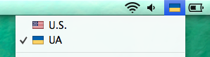

Ukrainian keyboard with Russian letters
==

UA.bundle - press Alt key to enter Russian letters.  
UA alt.bundle - press Alt key to enter Ukrainian letters.

Keys combinations:
--
<kbd>Alt</kbd> + <kbd>ы</kbd> = <kbd>і</kbd>  
<kbd>Alt</kbd> + <kbd>ё</kbd> = <kbd>ґ</kbd>  
<kbd>Alt</kbd> + <kbd>ъ</kbd> = <kbd>ї</kbd>  
<kbd>Alt</kbd> + <kbd>э</kbd> = <kbd>є</kbd> 

How to Install
--

1. Copy UA.bundle or UA alt.bundle to ~/Library/Keyboard Layouts
2. Go to Keyboard Preferences and add new layout from list.

Based on [Ilya Birman's typography layout](http://ilyabirman.ru/projects/typography-layout/).
